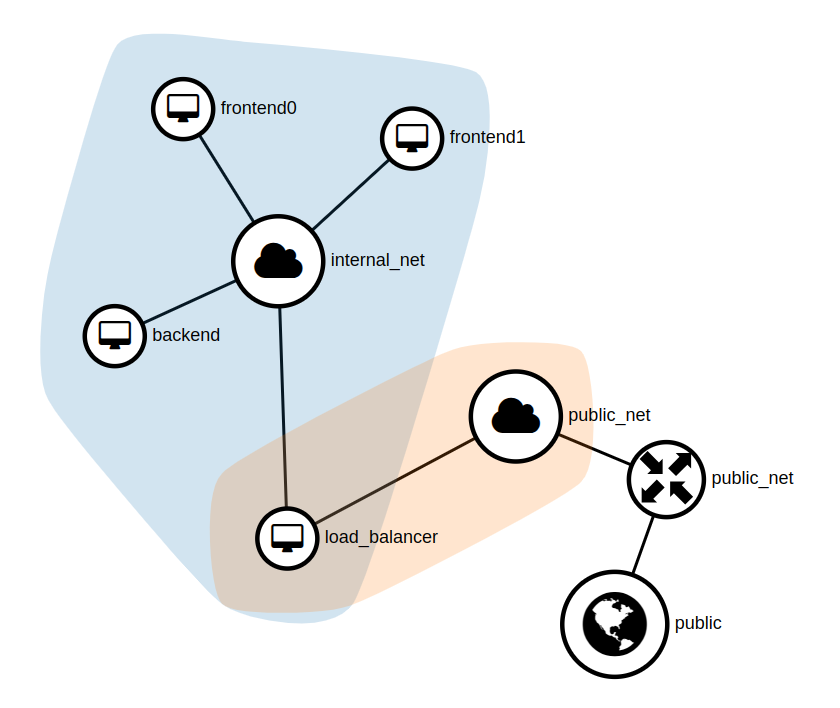

# Configuration management: Openstack

Small examples to experiment with Openstack.

## Plan

1. [Openstack on CLI](#openstack-on-cli), creating a simple compute instance
2. [Simple compute instance with a SSH access](#simple-compute-instance-with-a-ssh-access)
   1. [Terraform / Tofu](#terraform--tofu)
   2. [HEAT Templates](#heat-templates)
3. [Final project](#final-project)
   With `openstack LB` ➡️ `Front 1 | Front 2` ➡️ `Back` (or Kubernetes)


## Openstack on CLI

Requirements:

- Openstack CLI installed
- We assume that you have a working Openstack environment
- An Openstack key pair with your SSH public key  
  (replace `<YOU_KEY_PAIR_NAME>` with your key pair name)

```bash
$ openstack server create --flavor m1.small --image Debian-12 \
  --network default --security-group default \
  --key-name <YOU_KEY_PAIR_NAME> \
  myinstance --wait
```

You can replace the flavor and image with what you want to use.

## Simple compute instance with a SSH access

### Terraform / Tofu

Simple compute instance accessible through SSH after its creation.

See it in the [`02_terraform/`](./02_terraform_tofu/) directory.

Here, I use [`tofu`](https://opentofu.org/), but you should also be able to use Terraform.

```bash
$ cd 02_terraform/

$ tofu init

$ cp terraform.tfvars.dist terraform.tfvars

$ tofu apply
```

> [!NOTE]
> You can remove the variable [`openstack_provider_config`](./02_terraform_tofu/variables.tf), and instead use the argument `cloud` in your [openstack provider config](./02_terraform_tofu/providers.tf) to use your current Openstack environment.
>
> But personally, I prefer to specify the environment each time.

### Heat Templates

Simple compute instance accessible through SSH after its creation.

See it in the [`03_heat/`](./03_heat/) directory.

```sh
cd 03_heat/

openstack stack create mystack --template main.yaml --environment params.yaml
```

> [!TIP]
> To use the `stack` commands, you need to have installed the heat plugin for the openstack CLI:
>
> With APT: `sudo apt install python3-heatclient`
> 
> With pip: `pipx python-heatclient`

## Final project

See it in the [`project/`](./project/) directory.

Goals:
- Deploy the infrastructure with Terraform
- Install Kubernetes on cloud-init (Ansible needed?)
- USe Flux to deploy the application

For now, network topology (maybe the names will change for k8s nodes):


