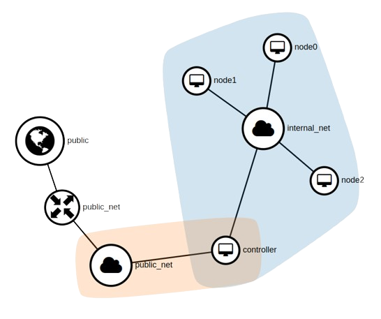

# Configuration management: Openstack

Experiments to deploy infrastructure and applications on Openstack.

## Project

### Goals

- Deploy the infrastructure with Terraform
- Install Kubernetes on cloud-init (Ansible needed?)
- Use Flux to deploy the application
- The application needs to have this rough structure:  
  `openstack LB` ➡️ `Front 1 | Front 2` ➡️ `Back`

### Create the infrastructure

Requirements:
- [`tofu`](https://opentofu.org/) or terraform CLI
- Openstack CLI installed

The network topology will be created like this:



To deploy the infrastructure, run the following commands:

```bash
$ tofu init

# and edit the parameters
$ cp terraform.tfvars.dist terraform.tfvars

$ tofu apply
```

## Experiments

1. [Openstack on CLI](./experiments/cli/)
2. [Openstack on HEAT Templates](./experiments/heat/)
